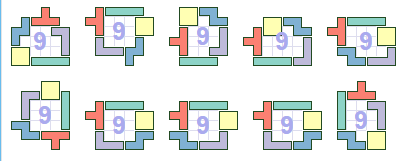
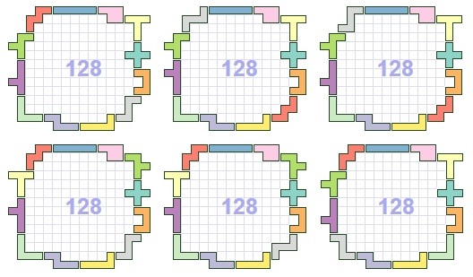
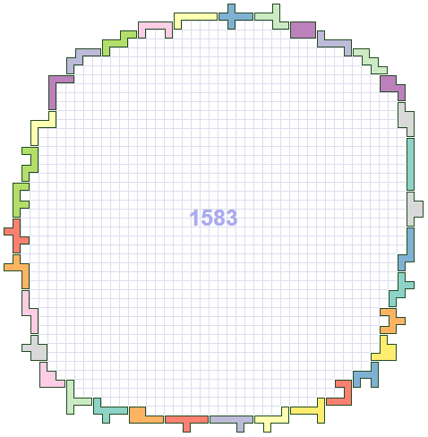

## Purpose

Random search solver for a "polyomino farm" problem, written as a Rust learning exercise. 

Generates HTML/SVG files visualizing the results at every optimization step.


## The problem

*Given a set of polyominoes, arrange them such that they enclose the largest area possible.*


## Requirements 

You need to have Rust/Cargo installed. I recommend using [Rustup](https://www.rust-lang.org/en-US/install.html)


## Instaling/running

```bash
$ cargo run
```

Cargo will take care of downloading the needed dependencies and running the program.

Intermediate results will be dumped into the file `output.html`.


## Command line options

The program can take additional options, which can be passed through cargo like this:

```bash
$ cargo run -- --seed 42
```

The possible options are:

```
    -h, --help          print the help text
    -m, --no-mirror     don't mirror the shapes
    -r, --no-rotation   don't rotate the shapes
    -o, --output FILE   output HTML file path
    -s, --seed NUMBER   random seed
    -g, --gen-size NUMBER
                        generation size
    -n, --max-iter NUMBER
                        maximum iteration
    -e, --elites NUMBER number of elites to preserve between generations
    -c, --cell-side NUMBER
                        SVG cell side, pixels
    -p, --mut-percentage NUMBER%
                        percentage of generation to mutate
    -a, --mut-attempts NUMBER
                        mutation attempts per gene

```


## Example solutions for tetrominoes:



### Pentominoes:



### Hexominoes:




## Reference C++ implementation

The reference C++ implementation [is available in a separate repository](https://github.com/silverio/polyfarm-cpp).

The goal was to get a feel of writing the same thing in these two languages, side-by-side.

Rust, naturally, had been a bittersweet experience - frustrating at first, but then very enjoyable.
As compared to the even C++ experience, anyway - but that's of course I'm used to C++.

## License

The contents of this repository are covered under the [MIT License](LICENSE).

