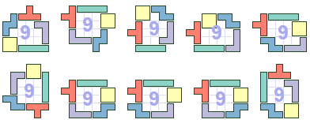

## Purpose

Random search solver for a "polyomino farm" problem: 

Written as a Rust learning exercise. 

Generates HTML/SVGs visualizing the results.


## The problem

*Given a set of polyominoes, arrange them such that they enclose the largest area possible.*


## Requirements 

You need to have Rust/Cargo installed. I recommend using [Rustup](https://www.rust-lang.org/en-US/install.html)


## Instaling/running

```bash
$ cargo run
```

Cargo will take care of downloading the needed dependencies and running the program.

The intermediate results will be dumped into the file `output.html`.


## Example solutions for tetrominoes:



Pentominoes:


Hexominoes:


## Reference C++ implementation

The reference C++ implementation [is available in a separate repository](https://github.com/silverio/polyfarm-cpp).

The goal was to get a feel of writing the same thing in these two languages, side-by-side.

Rust, naturally, had been a bittersweet experience - frustrating at first, but then very enjoyable.
As compared to the even C++ experience, anyway - but that's of course I'm used to C++.

## License

The contents of this repository are covered under the [MIT License](LICENSE).

